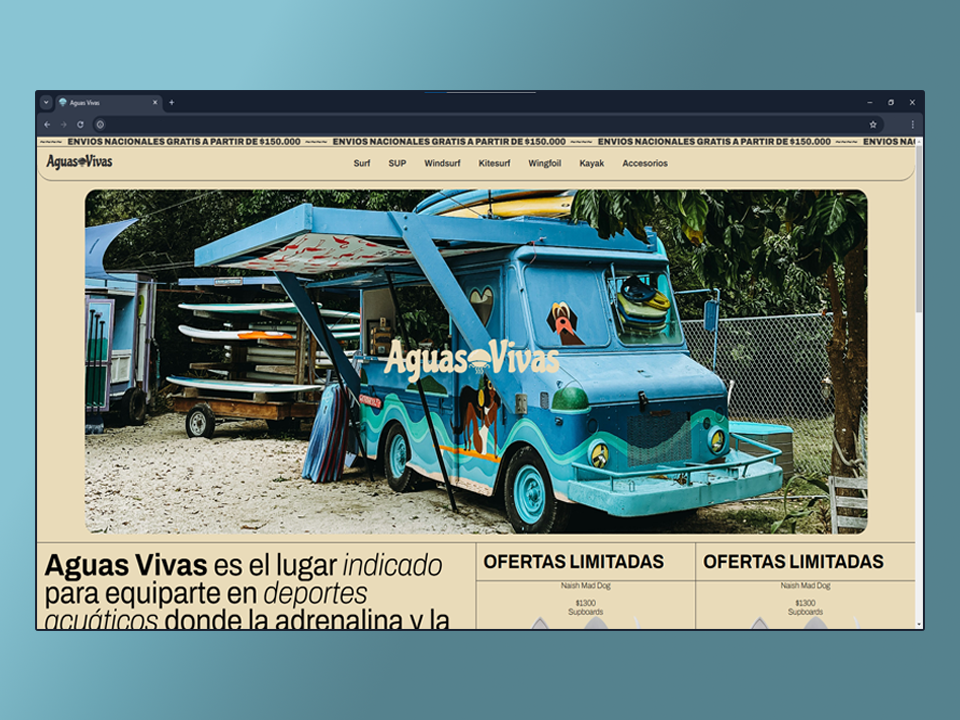

## Aguas Vivas E-Commerce

Esta es mi página web e-commerce realizada en el marco del curso "Talento Tech Front-End JS 2024".

Tabla de contenidos

- [Características principales](#características-principales)
  - [Capturas de pantalla de la web de La Velada IV](#capturas-de-pantalla)
- [🛠️ Stack](#️-stack)

## Características principales

- **Detalles del evento**: Obtén información detallada sobre la fecha, hora, ubicación y artistas participantes.
- **Compra de boletos**: Permite a los usuarios dirigirlos a la compra de boletos fácilmente.
- **Redes sociales**: Conoce las redes oficiales donde podrás informarte sobre el evento.

### Capturas de pantalla

(<a href="#readme-top">volver arriba</a>)

## 🛠️ Herramientas

<a href="https://fonts.google.com/">
   - Making the web more beautiful, fast, and open through great typography.
</a> 

(<a href="#readme-top">volver arriba</a>)

