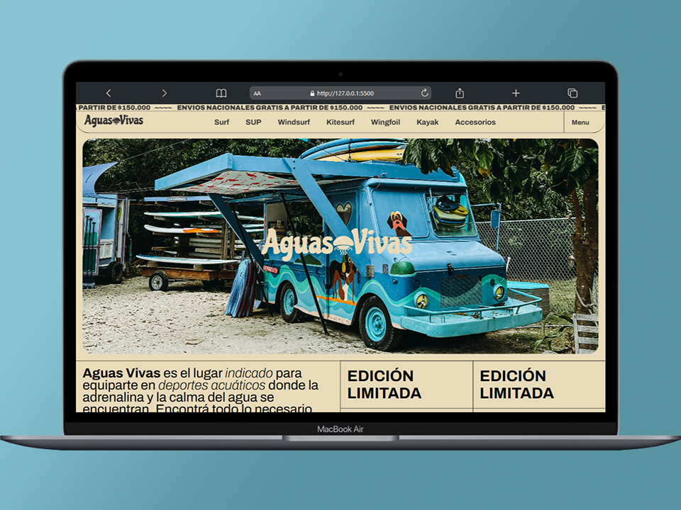

## Aguas Vivas E-Commerce

Esta es mi página web e-commerce realizada en el marco del curso "Talento Tech Front-End JS 2024".

Tabla de contenidos

- [Características principales](#características-principales)
  - [Capturas de pantalla](#capturas-de-pantalla)
- [🛠️ Herramientas](#️-stack)

## Características principales

- **Home**: Landing page con navbar, productos, seccion de contacto y reseñas. 
- **Navegación interna**: Navegacion por las distintas paginas de productos.
- **Carrito de compra**: (Por desarrollar)

### Capturas de pantalla

(<a href="#readme-top">volver arriba</a>)

## 🛠️ Herramientas

- Making the web more beautiful, fast, and open through great typography.

(<a href="#readme-top">volver arriba</a>)

